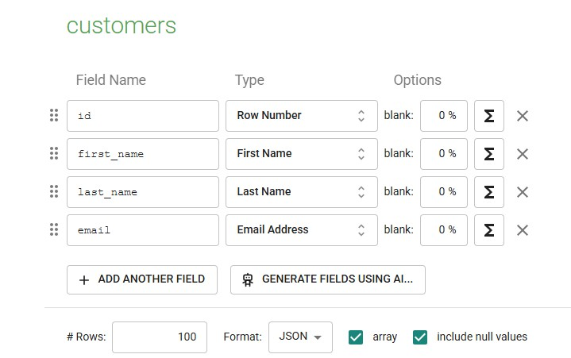
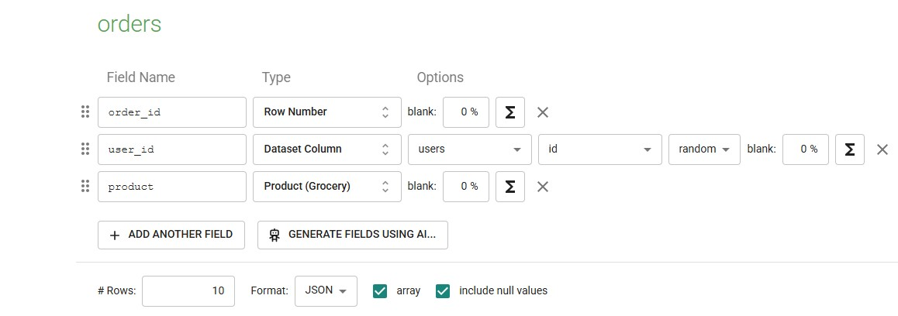
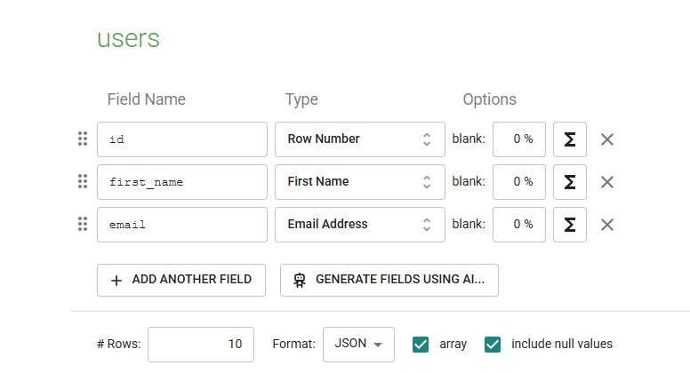
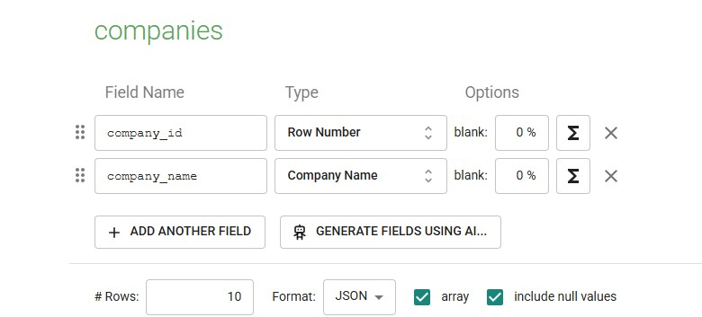
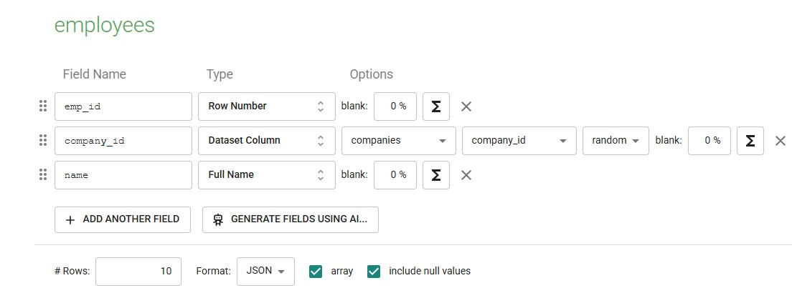
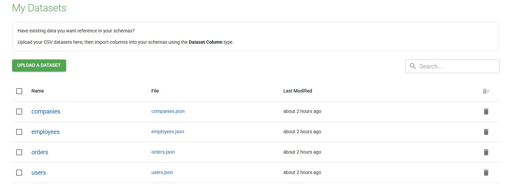

# MOCKAROO API

## Overview

This project demonstrates how to use the Mockaroo API to generate mock data for various schemas. It includes Docker-based development setup, schema replication, and API integration.

## Prerequisites

1. **Mockaroo Account**: Create an account at [Mockaroo](https://mockaroo.com/) to access the API and manage schemas.
2. **API Key**: Obtain your API key from the Mockaroo dashboard after logging in. Add it to the `.env` file as shown below.

## Setting Up the Environment

### 1. Configure `.env` File

Create a `.env` file in the project root or use the provided `.env.example` file. Add your Mockaroo API key:

```bash
MOCKAROO_API_KEY=YOUR_API_KEY
PYTHON_VERSION=3.12
```

Replace `YOUR_API_KEY` with the API key obtained from Mockaroo.

### 2. Install Dependencies

The project requires Python `>=3.12` and the `requests` library. Dependencies are managed via `pyproject.toml`:

```toml
[project]
dependencies = [
    "requests>=2.32.3",
]
```

### 3. Use Docker for Development

Refer to the [Docker Development Environment](README.Docker.md) for detailed instructions. Common commands include:

- **Build and Start**:

    ```bash
    docker compose up --build -d
    ```

- **Access the Container Shell**:

    ```bash
    docker compose exec app bash
    ```

- **Run the Application**:

    ```bash
    docker compose exec app python main.py
    ```

## Schemas and Datasets

### Creating Schemas on Mockaroo

1. **Login to Mockaroo**: Go to [Mockaroo](https://mockaroo.com/) and log in.
2. **Create a Schema**: Use the schema JSON files in the `/schema` folder to replicate schemas on the Mockaroo site. For example:
    - `users.schema.json` defines a schema for user data.
    - `orders.schema.json` defines a schema for order data.

3. **Save the Schema**: Save the schema with a name (e.g., `users`, `orders`) to use it with the API.

### Example Schemas

#### Customers



#### Orders



#### Users



#### Companies



#### Employees



#### Datasets



## Usage

### Running the Application

1. **Start the Docker Environment**:

    ```bash
    docker compose up --build -d
    ```

2. **Run the Application**:

    ```bash
    docker compose exec app python main.py
    ```

3. **Generate Mock Data**:
    The application will use the schemas defined in the `/schema` folder to generate mock data using the Mockaroo API.

### Example Command

```sh
uv run python main.py
```

### Live Code Reloading

Edit files locally, and changes will sync to the container. Restart the application to test updates.

## References

- [Mockaroo API Documentation](https://mockaroo.com/api/docs)
- [Docker's Python Guide](https://docs.docker.com/language/python/)
- [Docker Compose Watch Documentation](https://docs.docker.com/compose/file-watch/)
